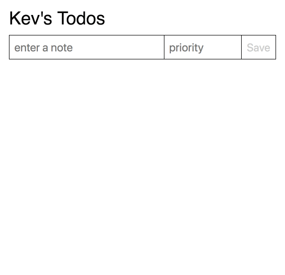

# todo #

This is a very simple todo application written in Ember.js which I built for an interview.

It's a single page application which allows a user to add, view, and delete todos and also shows the number of occurences of todo priorities.

### demo ###

